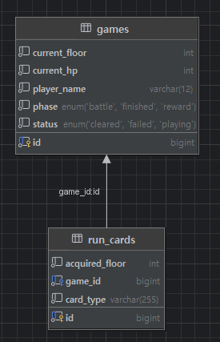

# Crimson Citadel — 게임 서버 과제

Spring Boot + JPA + MySQL(Docker)로 구현한 "붉은 달의 성채" 게임 저장 서버입니다. 전투 계산, 적 배치, 보상과 층 전이는 게임 클라이언트가 담당하고, 서버는 게임과 덱을 저장·조회하는 CRUD API를 제공합니다.

## API 명세

| 메서드 | 경로 | 설명 | 성공 | 실패 |
| --- | --- | --- | --- | --- |
| POST | `/games` | 게임과 시작 덱 생성 | 201 | 400 |
| GET | `/games` | 게임 요약 목록 조회 (id 내림차순) | 200 | - |
| GET | `/games/{gameId}` | 게임 상세와 전체 덱 조회 | 200 | 404 |
| PUT | `/games/{gameId}/progress` | 진행 필드와 전체 덱 저장 | 200 | 400, 404 |
| PATCH | `/games/{gameId}` | 플레이어 이름 변경 | 204 | 400, 404 |
| DELETE | `/games/{gameId}` | 게임과 덱 삭제 | 204 | 404 |

- 400: 요청 본문이 API 명세의 필드 제약(`@Valid`)을 어긴 경우
- 404: 존재하지 않는 `gameId`를 요청한 경우 (`GameService.findGame()`에서 발생)

전체 요청/응답 필드는 [API 문서](https://f-api.github.io/game-spring-api-docs/basic/api-docs.html)를 따릅니다.

## ERD



- `Game` 1 : `RunCard` N 관계이며, 참조는 `RunCard → Game` **단방향**입니다. (`Game`은 `RunCard` 목록을 필드로 가지지 않음)
- `RunCard`는 항상 `Game`을 통해서만 조회·저장·삭제되며, `Game`에는 cascade나 양방향 컬렉션을 두지 않습니다. 게임 삭제 시 자식(`RunCard`)을 먼저 삭제한 뒤 부모(`Game`)를 삭제합니다.

## 실행 방법

### 1. Docker로 MySQL 실행

```bash
docker run -d --name game-mysql -p 3306:3306 \
  -e MYSQL_ROOT_PASSWORD=root1234 \
  -e MYSQL_DATABASE=gamebasic \
  mysql:8.4
```

### 2. 서버 실행

```bash
./gradlew bootRun
```

### 3. 접속

브라우저에서 `http://localhost:8080` 접속

## 환경 변수 설정

`src/main/resources/application.properties`에 아래와 같이 데이터소스를 설정했습니다. (위 Docker 컨테이너 설정과 일치)

```properties
spring.datasource.url=jdbc:mysql://localhost:3306/gamebasic
spring.datasource.username=root
spring.datasource.password=root1234
spring.datasource.driver-class-name=com.mysql.cj.jdbc.Driver

spring.jpa.properties.hibernate.dialect=org.hibernate.dialect.MySQLDialect
spring.jpa.hibernate.ddl-auto=update
spring.jpa.show-sql=true
spring.jpa.properties.hibernate.format_sql=true
```

## 과제 제출 질문 답변

### 1. Controller, Service, Repository는 각각 어떤 역할을 맡나요?

- **Controller**: HTTP 요청을 받는 창구입니다. URL 경로와 HTTP 메서드(GET/POST/PATCH/DELETE)를 매핑하고, 요청 데이터를 검증(`@Valid`)한 뒤 Service에 위임합니다. 비즈니스 로직은 담지 않습니다.
- **Service**: 실제 비즈니스 로직을 처리합니다. 트랜잭션(`@Transactional`)의 경계를 정하고, 필요한 여러 Repository를 조합해 하나의 작업 단위를 완성합니다.
- **Repository**: DB와의 통신만 담당합니다. JPA를 통해 엔티티를 저장·조회·삭제하며, 비즈니스 로직은 포함하지 않습니다.

이렇게 역할을 나누는 것이 3 Layer Architecture이며, 각 계층이 자신의 책임만 맡아서 코드의 수정 범위가 서로 분리됩니다.

### 2. `@Service`를 붙이지 않으면 서버가 뜨지 않는 이유는 무엇인가요?

Spring은 `@Service`, `@Controller`, `@Repository`, `@Component` 같은 애노테이션이 붙은 클래스만 빈(Bean)으로 등록해서 관리합니다. `@Service`를 붙이지 않으면 해당 클래스의 객체를 Spring이 만들어서 관리하지 않으므로, 그 클래스를 생성자 주입으로 필요로 하는 다른 클래스(Controller 등)가 있을 때 `required a bean of type ... that could not be found` 에러가 발생하며 애플리케이션 컨텍스트 초기화에 실패합니다.

### 3. `@Transactional(readOnly = true)`는 무슨 뜻이며, 저장하는 메서드에 붙이면 왜 안 되나요?

`@Transactional(readOnly = true)`는 "이 트랜잭션 안에서는 DB를 읽기만 한다"고 선언하는 것입니다. 이 선언을 보고 Spring/Hibernate는 DB 커넥션을 읽기 전용 모드로 최적화합니다. 그런데 저장(`save()` 등 INSERT/UPDATE/DELETE)이 일어나는 메서드에 이 옵션을 붙이면, 읽기 전용으로 설정된 커넥션에 쓰기를 시도하게 되어 `Connection is read-only` 같은 에러가 발생합니다. 따라서 쓰기가 일어나는 메서드에는 `readOnly` 없이 `@Transactional`만 사용해야 합니다.

### 4. `@NotBlank`, `@NotNull`, `@NotEmpty`는 각각 어떤 값을 걸러내나요?

| 애노테이션 | 대상 | 거부하는 값 |
| --- | --- | --- |
| `@NotNull` | 모든 타입 | `null` |
| `@NotEmpty` | 문자열/컬렉션 | `null`, `""`, 빈 리스트 |
| `@NotBlank` | 문자열 전용 | `null`, `""`, 공백만 있는 문자열(`"   "`) |

`@NotBlank`가 세 개 중 가장 엄격하며, 문자열에만 적용할 수 있습니다.

### 5. 엔티티를 그대로 응답하지 않고 DTO로 바꿔서 응답하는 이유는 무엇인가요?

첫째, 엔티티를 그대로 노출하면 API 응답 구조가 DB 테이블 구조에 종속되어, DB 스키마를 바꿀 때마다 API 명세가 흔들립니다. 둘째, 화면(용도)마다 필요한 데이터가 다릅니다. 예를 들어 게임 목록 조회(`GameSummaryResponse`)는 덱 정보가 필요 없지만 상세 조회(`GameDetailResponse`)는 덱 전체가 필요합니다. 엔티티 하나로 이 둘을 같이 감당하려 하면 불필요한 데이터까지 내려주게 되거나, 지연 로딩 프록시가 그대로 직렬화되며 예외가 발생할 수 있습니다. DTO를 쓰면 응답 목적에 맞는 최소한의 데이터만, API 명세에 맞는 형태로 안전하게 내려줄 수 있습니다.

### 6. 이름 변경에서 `save()`를 호출하지 않았는데 DB에 반영되는 이유는 무엇인가요?

JPA의 **더티 체킹(변경 감지, Dirty Checking)** 때문입니다. `@Transactional` 메서드 안에서 `gameRepository.findById()`로 조회해온 엔티티는 영속성 컨텍스트가 관리하는 상태가 됩니다. 이 상태에서 `game.rename(...)`처럼 필드 값을 직접 바꾸면, 트랜잭션이 끝나는 시점에 Hibernate가 "조회 시점의 스냅샷"과 "현재 값"을 비교해서 변경된 필드를 감지하고, 자동으로 UPDATE 쿼리를 실행합니다. 그래서 `save()`를 명시적으로 호출하지 않아도 변경 사항이 DB에 반영됩니다.
